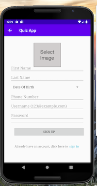
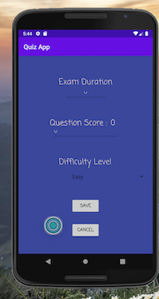

# Quiz App

This is an Android application designed for creating, managing, and answering quiz questions. The app allows users to register, log in, create new questions with multiple choice answers, and manage their questions. The app uses an SQLite database to store user information and quiz questions.

## Features

- **User Registration and Login**: Users can register for an account and log in using their email and password.
- **Question Management**: Users can create, update, and delete quiz questions.
- **Image Attachments**: Users can attach images to their questions.
- **Settings Management**: Users can configure the exam duration, number of questions, and difficulty level.
- **SQLite Database**: The app uses an SQLite database to store user information and questions.

## Screenshots

## Screenshots

### Login Screen


### Sign Up Screen


### Main Menu


### Create Question


### Create Exam


## Getting Started

### Prerequisites

- Android Studio
- A physical Android device or an emulator

### Installation

1. Clone the repository:

   ```bash
   git clone link
